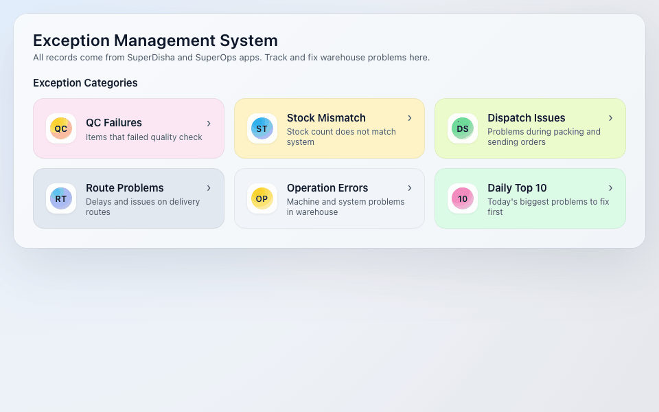

# Exception Management System

## Problem Statement

Operational exceptions such as QC failures, stock mismatches, dispatch errors, route delays, and picking/loading errors are currently tracked manually or not tracked at all across warehouse and logistics operations. There is no centralized, prioritized daily view for management to monitor operational health.

This leads to:
- Repeat errors going undetected due to lack of historical tracking
- Slow resolution times with no clear ownership or accountability
- Limited visibility into warehouse and logistics performance
- No automated escalation when issues remain unresolved
- Revenue loss and customer dissatisfaction from unresolved operational gaps

## Solution Overview

Our solution addresses the lack of real-time operational exception visibility in warehouse and logistics operations. We built a **centralized Exception Management System (EMS)** that provides:

- **Real-time exception logging** via Android applications (SuperDisha and SuperOps apps) and web dashboard
- **Clear ownership and lifecycle-based status tracking** with defined status flows per module
- **Backend-triggered mobile notifications** via FCM to responsible users on every status change
- **Automated Daily Top 10 issue ranking** using a weighted scoring formula for management prioritization
- **Management visibility** of operational health across all warehouses

The system covers **7 functional modules**: QC Failure Tracking, Stock Mismatch Alerts, Dispatch Support & Operational Issue Alerts, Route Delay Monitoring, Operation Error Capture, Top 10 Daily Issues Engine, and Notification & Escalation Engine.

## Architecture

```
+---------------------+       +-------------------------+       +----------------------------+
|    Android Apps      |       |    React 19 Dashboard   |       |    Supabase Backend        |
| (SuperDisha/SuperOps)| ----> |     (Web Portal)        | ----> |  (PostgreSQL + REST API)   |
+---------------------+       +-------------------------+       +----------------------------+
        |                              |                                    |
        |  Report exceptions           |  View / Manage / Track            |  Auto-generated REST API
        |  from the field              |  exceptions in real-time          |  Row Level Security (RLS)
        |                              |                                    |  DB Triggers (auto date)
        v                              v                                    v
+---------------------+       +-------------------------+       +----------------------------+
|  Exception Capture   |       |   Dashboard Features    |       |   PostgreSQL Database      |
| - QC scan + report   |       | - Category drill-down   |       | - qc_failures              |
| - Stock flag         |       | - Status lifecycle mgmt |       | - stock_mismatch           |
| - Route issue + GPS  |       | - Daily Top 10 engine   |       | - dispatch_support_logs    |
| - Dispatch log       |       | - Date-based filtering  |       | - route_issues             |
| - Operation error    |       | - One-click sample add  |       | - operation_errors         |
+---------------------+       | - Notification toasts   |       +----------------------------+
                               +-------------------------+                  |
                                                                            v
                                                               +----------------------------+
                                                               |   Notification Engine      |
                                                               |   (Firebase Cloud Messaging)|
                                                               |   - On exception creation  |
                                                               |   - On status change       |
                                                               |   - On escalation          |
                                                               +----------------------------+
```

## Tech Stack

| Layer | Technology |
|-------|-----------|
| **Frontend** | React 19, JavaScript (ES6+), CSS3 |
| **Backend** | Supabase (auto-generated REST API over PostgreSQL) |
| **Database** | PostgreSQL (hosted on Supabase Cloud, Mumbai region) |
| **Cloud/Infra** | GitHub Pages (frontend hosting), Supabase Cloud (database + API) |
| **Notifications** | Firebase Cloud Messaging (FCM) for push notifications |
| **Mobile** | Android (SuperDisha App, SuperOps App) |
| **CI/CD** | GitHub Pages deployment via `gh-pages` |

## Database

The application uses a **Supabase PostgreSQL** database with 5 tables, auto-generated REST API, Row Level Security (RLS), and database triggers for auto-populating date fields.

| Table | Fields | Records | Description |
|-------|--------|---------|-------------|
| `qc_failures` | 19 | 17+ | QC failure tracking with item details, batch info, QR codes, reasons, and corrective actions (captured from SuperOps app) |
| `stock_mismatch` | 11 | 11+ | Stock inventory discrepancy alerts with scenario classification and verification workflow (captured from SuperOps app) |
| `dispatch_support_logs` | 13 | 12+ | Dispatch, picking, and loading issue logs with photo support and issue categorization (captured from SuperOps app) |
| `route_issues` | 14 | 11+ | Route delay and incident reports with GPS coordinates and help request flags (captured from SuperDisha app) |
| `operation_errors` | 8 | 14+ | General operational and system error tracking (captured from SuperOps app) |

**Database Features:**
- Row Level Security (RLS) with public read/insert/update policies
- Database triggers (`set_date_column()`) for automatic date population on insert using IST timezone
- Date format: D-M-YYYY (e.g., 2-3-2026) for Indian locale
- 10-minute client-side caching with localStorage for fast subsequent loads
- Cache versioning for automatic stale data invalidation
- Embedded seed data fallback for offline/demo scenarios

**View/Manage Database Tables:**
[Supabase Dashboard - Table Editor](https://supabase.com/dashboard/project/twaohpngrwurqxlswfjv/editor)

**Supabase Project URL:** `https://twaohpngrwurqxlswfjv.supabase.co`

## Features

### Module 1: QC Failure Tracking

Record, monitor, and resolve product quality issues identified during picking.

**Status Lifecycle:** `OPEN` -> `DUMPED` / `REPACKING` / `FUMIGATION` -> `CLOSED`

**Status Options:**
- `DUMPED` -- Item disposed due to irreparable quality issue
- `REPACKING` -- Item sent for repacking and correction
- `FUMIGATION` -- Item sent for fumigation treatment

**Fields tracked:** Item ID, Item Name, Brand, QR ID, Batch ID, Expiry Date, Variety, Quantity, Reason, Warehouse, Created By, Phone Number, Notify Phone, Status

**Repacking Business Logic:**
- When status = REPACKING:
  1. Mark failed stock as corrected
  2. Make item available again for picking
  3. Trigger notification to original picker

**Notification Triggers:**
- On QC Creation -> Notify picker allocator (NOTIFY_PHONE)
- On Status Update -> Notify creator with success message
- On Repacking Completion -> Notify picker that item is ready for picking again

**Data Source:** All QC failure records are captured from **SuperDisha** app by warehouse pickers during quality checks.

**Business Impact:** Reduced dispatch of defective goods, faster corrective action tracking, improved warehouse accountability, better inventory control after repacking.

---

### Module 2: Stock Mismatch Alerts

Detect and resolve inventory inconsistencies where physical stock is available but system inventory shows zero or incorrect quantity.

**Status Lifecycle:** `OPEN` -> `VERIFIED` -> `RESOLVED`

**Scenario Types:**
- `SYSTEM_QTY_MORE_THAN_PHYSICAL` -- System shows more stock than physically available
- `SYSTEM_QTY_LESS_THAN_PHYSICAL` -- Physical stock exists but system shows less
- `PHYSICAL_QTY_ZERO` -- Physical stock depleted but system still shows inventory

**Business Logic:**
- IF system_inventory_qty <= 0 AND physical_stock_detected = TRUE:
  1. Create stock_mismatch record (status = OPEN)
  2. Trigger notification to allocator
  3. Block allocation (optional based on policy)

**Notification Triggers:**
- On Mismatch Creation -> Notify allocator (NOTIFY_PHONE)
- On Verification -> Notify picker (PHONE_NUMBER)
- On Resolution -> Notify picker that item is now available in system

**Business Impact:** Faster detection of inventory gaps, improved stock accuracy, prevention of lost sales due to incorrect stock visibility, stronger inventory audit control.

---

### Module 3: Dispatch Support & Operational Issue Alerts

Enable warehouse users to quickly report operational problems faced during picking, loading, vehicle dispatch, and other operational challenges.

**Status Lifecycle:** `OPEN` -> `IN_PROGRESS` -> `RESOLVED` -> `CLOSED`

**Issue Categories:** `DAMAGED_IN_TRANSIT` | `MISSING_ITEM` | `DELAYED_PICKUP`

**Android Requirement:** "Need Help / Report Issue" option in Picking, Loading, and Dispatch screens with:
- Issue Category selection (mandatory)
- Brief description (mandatory)
- Optional photo upload (Camera / Gallery)
- Optional Route ID, Order ID, Item ID

**Notification Triggers:**
- On Issue Creation -> Notify warehouse admin and operations team
- On Status = IN_PROGRESS -> Notify reporter
- On Resolution -> Notify reporter that issue has been resolved

**Business Impact:** Faster problem escalation, reduced dispatch delays, improved route reliability, complete digital audit history.

---

### Module 4: Route Delay Monitoring

Enable drivers to report en-route delays or incidents in real time and request support when required.

**Status Lifecycle:** `OPEN` -> `SUPPORT_SENT` -> `RESOLVED`

**Issue Types:** `BREAKDOWN` | `TRAFFIC_JAM` | `WRONG_ADDRESS`

**Captured Data:** Route ID, Driver ID, Issue Type, Description, Latitude, Longitude, Photo (optional), Need Help (Yes/No)

**Business Logic:**
1. Create route_issues record on submission
2. Auto-capture GPS location (latitude/longitude)
3. Trigger alert to transport team
4. High priority if Need Help = Yes

**Notification Triggers:**
- On Issue Creation -> Alert transport team
- On Support Sent -> Notify driver
- On Resolution -> Close issue

**Business Impact:** Faster incident response, reduced delivery delays, improved driver safety, better route monitoring.

---

### Module 5: Operation Error Tracking

Centralize high-level operational and system errors for management visibility and follow-up.

**Status Lifecycle:** `OPEN` -> `IN_PROGRESS` -> `RESOLVED` -> `CLOSED`

**Example Issues:** Picking delay in outbound staging area, invoice printing system not working, handheld sync delay, barcode scanner malfunction, cold storage temperature alert, conveyor belt jam, label printer offline.

---

### Module 6: Daily Top 10 Issues Engine

Automated ranking of the most critical operational issues dynamically using real-time scoring calculation.

**Data Sources:** Reads from all 5 tables -- `qc_failures`, `stock_mismatch`, `dispatch_support_logs`, `route_issues`, `operation_errors`

**Grouping Logic:** Issues grouped by `exception_type` + `reference_id` + `warehouse`

**Scoring Formula:**
```
Score = (Today Issue Count x 2) + Last 7 Days Repeat Count
```
Today's occurrences are given higher weight (x2) to prioritize current critical issues. Higher score = higher rank.

**Example Calculation:**
```
QC Failure - Item 1004784602 - DHANSAR
Today: Occurred 5 times
Last 7 days total: Occurred 8 times
Score = (5 x 2) + 8 = 18
```

**Features:**
- Top 10 ranked list with real-time scoring
- Focus Top 3 mode for management quick-view
- Date reference and total record count display

**Sample Response:**
```json
{
  "date": "2-3-2026",
  "total_records": 10,
  "data": [
    {
      "rank": 1,
      "exception_type": "QC_FAILURE",
      "reference_id": "1004784602",
      "warehouse": "DHANSAR",
      "today_count": 5,
      "repeat_count": 3,
      "score": 13
    },
    {
      "rank": 2,
      "exception_type": "STOCK_MISMATCH",
      "reference_id": "1004784601",
      "warehouse": "TALOJA",
      "today_count": 4,
      "repeat_count": 2,
      "score": 10
    }
  ]
}
```

---

### Module 7: Notification & Escalation Engine

Real-time communication to responsible users when exceptions are created, updated, status changed from dashboard, or escalated.

**Notification Trigger Conditions:**
- `OPEN` -> `DUMPED` / `REPACKING` / `FUMIGATION`
- `OPEN` -> `CLOSED`
- `IN_PROGRESS` -> `RESOLVED`
- `SUPPORT_SENT` -> `RESOLVED`

**Delivery Mechanism:**
1. Backend reads `phone_number` / `notify_phone` from respective table
2. Triggers Push Notification via Firebase Cloud Messaging (FCM)
3. Dashboard shows toast notification with contextual message

**Notification Examples:**
- *"QC failure logged. Notifying allocator at 9123456780."*
- *"Repacking completed. You can resume picking for this item."*
- *"Stock mismatch detected. Physical stock available but system shows zero. Verification required."*
- *"Operational issue reported in Dispatch. Immediate attention required."*

---

### Additional Features

8. **One-Click Sample Entry** -- Instant addition of realistic random sample entries to any category for demo/testing purposes with auto-generated contextual data (item IDs, warehouse, phone numbers, dates).

9. **Date-Based Filtering** -- Filter records by date in D-M-YYYY format with Today shortcut and Show All toggle for flexible data exploration.

10. **Offline-Ready Seed Data** -- Embedded fallback data ensures the dashboard always displays records even when the database API is unreachable, with automatic sync when connectivity is restored.

## Expected Outcome

- Centralized exception tracking across all warehouse and logistics operations
- Real-time mobile notification on status changes via FCM
- Reduced repeat operational errors through Daily Top 10 visibility
- Faster issue resolution with clear ownership and lifecycle tracking
- Improved accountability with digital audit trail
- Daily operational visibility for management decision-making
- Stronger warehouse and logistics control

## Setup Instructions

### Prerequisites
- Node.js (v16 or higher)
- npm (v8 or higher)

### Local Development

1. Clone the repository:
   ```bash
   git clone https://github.com/dineshjangirkhetika/Exception_handling_portal.git
   ```

2. Navigate to the dashboard directory:
   ```bash
   cd Exception_handling_portal/dashboard
   ```

3. Install dependencies:
   ```bash
   npm install
   ```

4. Start the development server:
   ```bash
   npm start
   ```

5. Open [http://localhost:3000](http://localhost:3000) in your browser

### Environment Variables

The application uses Supabase as the backend. The following configuration is set in `src/supabaseClient.js`:

| Variable | Description |
|----------|-------------|
| `SUPABASE_URL` | Supabase project API endpoint |
| `SUPABASE_ANON_KEY` | Public anonymous key for client-side access (safe to expose) |

> **Note:** The Supabase anonymous key is a public key designed for client-side use with Row Level Security (RLS) policies. It is not a secret.

### Deployment

```bash
npm run build     # Build for production
npm run deploy    # Deploy to GitHub Pages
```

## Project Structure

```
Exception_handling_portal/
  dashboard/
    public/
      index.html            # HTML entry point
      demo.gif              # Animated demo walkthrough
      manifest.json         # PWA manifest
    src/
      App.js                # Root component with navigation
      supabaseClient.js     # Supabase client, caching, CRUD operations
      seedData.js           # Embedded fallback data for offline/demo
      styles.css            # Global styles
      components/
        DashboardHome.js    # Main dashboard with 6 category cards
        CategoryScreen.js   # Category detail view with data table, status updates, sample entry
        TopIssuesScreen.js  # Daily Top 10 scoring engine with focus mode
        StatusBadge.js      # Color-coded status indicator component
        Toast.js            # Notification toast component
    scripts/
      record-demo.js        # Puppeteer script to record demo GIF
    package.json
    README.md
```

## Demo



**Demo walkthrough:**
1. **Dashboard Home** -- All 6 category cards with simple descriptions
2. **QC Failures** -- Items that failed quality check (17 records from SuperDisha app)
3. **QC Failures - Today filter** -- Filter to see only today's records
4. **Stock Mismatch** -- Stock count does not match system (11 records from SuperDisha app)
5. **Dispatch Issues** -- Problems during picking, loading, or sending orders (12 records from SuperOps app)
6. **Route Problems** -- Driver problems on the road like breakdowns, traffic (11 records from SuperOps app)
7. **Operation Errors** -- Machine and system problems in warehouse (14 records from SuperOps app)
8. **Daily Top 10** -- Today's biggest problems ranked by score
9. **Focus Top 3** -- Quick view of the 3 most urgent issues

**Total records:** 65+ across all categories from SuperDisha and SuperOps apps.

**Re-record the demo GIF:**
```bash
npm start                        # Start the dashboard
node scripts/record-demo.js      # Record new demo.gif
```

## Live Demo

[https://dineshjangirkhetika.github.io/Exception_handling_portal](https://dineshjangirkhetika.github.io/Exception_handling_portal)

## Submission Description

Our solution addresses the lack of real-time operational exception visibility in warehouse and logistics operations.

We built a **centralized Exception Management System** -- a web-based platform that enables warehouse ops, QC teams, logistics staff, and management to capture, track, prioritize, and resolve operational exceptions through a unified dashboard with automated notifications and daily issue ranking.

**Key Features:**
1. Real-time exception tracking across 5 critical categories -- QC Failures, Stock Mismatch, Dispatch Issues, Route Delays, and Operation Errors
2. Lifecycle-based status tracking with defined status flows per module (OPEN -> DUMPED/REPACKING/FUMIGATION -> CLOSED, OPEN -> VERIFIED -> RESOLVED, etc.)
3. Automated Daily Top 10 issue ranking engine using weighted scoring: `Score = (Today Count x 2) + Last 7 Days Repeat Count`
4. Real-time push notifications via FCM on exception creation, status changes, and escalations with role-based routing
5. Repacking business logic -- automatically makes corrected items available for picking and notifies the original picker
6. GPS-enabled route issue reporting with help request prioritization
7. One-click sample entry for rapid demo and testing

**Technical Highlights:**
- Architecture: React 19 SPA + Supabase PostgreSQL with auto-generated REST API; records captured from SuperDisha and SuperOps Android apps
- Scalable design using Supabase Cloud (PostgreSQL + Row Level Security + DB Triggers)
- 5 PostgreSQL tables with 65+ fields covering complete exception lifecycle
- Database triggers for automatic IST date population on insert
- Client-side caching layer with localStorage (10-min TTL, versioned cache invalidation)
- Embedded seed data for zero-downtime demo capability
- Cloud-native deployment on GitHub Pages + Supabase Cloud (Mumbai region ap-south-1)

**Impact:**
- Replaces manual spreadsheet/WhatsApp-based exception tracking with structured digital workflow
- Reduces exception resolution time through prioritized daily ranking and real-time FCM notifications
- Provides management visibility into repeat issues and warehouse performance trends
- Enables proactive intervention before exceptions escalate into customer-facing problems
- Improves warehouse accountability with complete digital audit trail
- Prevents revenue loss from undetected stock mismatches and dispatch errors
